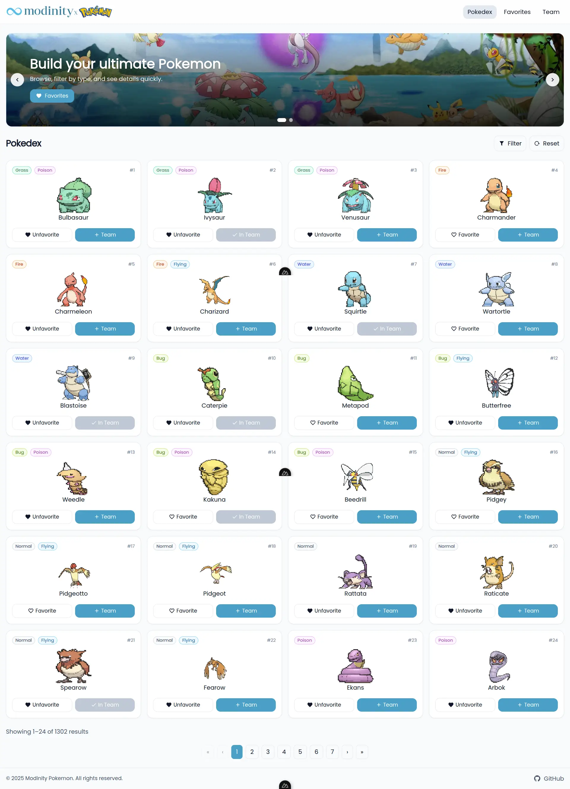

# Modinity Pokemon

This repo contains:

- `pokemon-fe` — Nuxt 4 SSR frontend (Tailwind, @nuxt/icon)
- `pokemon-be` — Express backend with SQLite (better-sqlite3)



## Local Development

Backend (port 3001):

```bash
cd pokemon-be
npm install
npm run dev
```

Frontend (port 3000):

```bash
cd pokemon-fe
npm install
# point FE to BE
export MODINITY_POKEMON_API_BASE=http://localhost:3001/api
npm run dev
```

## Docker

From the repo root you can build & run both services:

```bash
# Backend
./deploy-be.sh

# Frontend (requires API base URL)
MODINITY_POKEMON_API_BASE="http://localhost:3001/api" ./deploy-fe.sh
```
